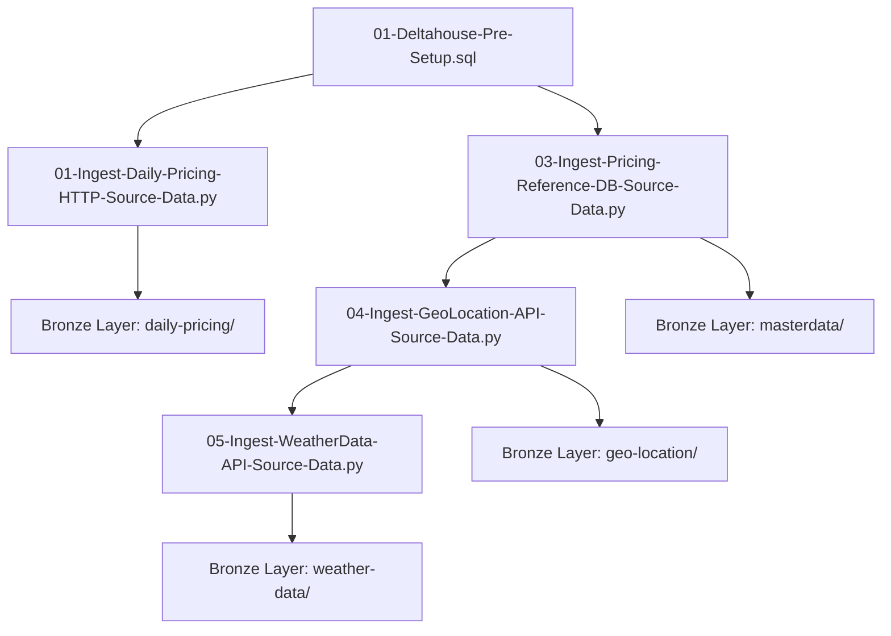

# 📥 Data Ingestion Layer

This folder contains all data ingestion pipelines that extract raw data from various sources and load it into the **Bronze Layer** of the Medallion Architecture.

## 📋 Overview

The ingestion layer is responsible for:
- Connecting to multiple data sources (HTTP, Azure SQL DB, REST APIs)
- Extracting raw data with minimal transformation
- Loading data into Azure Data Lake Storage Gen2 (ADLS)
- Tracking ingestion process runs for incremental loading
- Maintaining data lineage and audit trails

---

## 📂 Files in This Folder

### 1️⃣ **01-Deltahouse-Pre-Setup.sql**
**Purpose**: Initial setup script for creating catalog, schemas, and process tracking tables.

**What it does:**
- Creates Unity Catalog: `pricing_analytics`
- Creates schemas: `processrunlogs`, `bronze`, `silver`, `gold`
- Creates `DELTALAKEHOUSE_PROCESS_RUNS` table for tracking pipeline execution
- Sets up metadata framework for incremental processing

**Key Objects Created:**
```sql
-- Catalog structure
pricing_analytics
├── processrunlogs
│   └── DELTALAKEHOUSE_PROCESS_RUNS
├── bronze
├── silver
└── gold
```

**Process Run Log Schema:**
- `process_name`: Identifier for the pipeline
- `processed_file_table_date`: Date of processed data
- `process_status`: Completed/Failed
- `PROCESSED_TABLE_DATETIME`: Execution timestamp

**When to run:** Before any data ingestion (one-time setup)

---

### 2️⃣ **01-Ingest-Daily-Pricing-HTTP-Source-Data.py**
**Purpose**: Ingest daily pricing CSV files from HTTP endpoint (Azure Blob Storage)

**Data Source:**
- **Type**: HTTP/HTTPS
- **Format**: CSV
- **URL Pattern**: `https://retailpricing.blob.core.windows.net/daily-pricing/PW_MW_DR_{date}.csv`
- **Frequency**: Daily

**Key Features:**
- ✅ Widget-driven parameter input (`prm_processName`)
- ✅ Incremental loading based on process logs
- ✅ Dynamic date calculation for next file to process
- ✅ Pandas → Spark DataFrame conversion
- ✅ Metadata enrichment (source_file_load_date)
- ✅ Bronze layer storage (CSV format in ADLS)
- ✅ Process run logging

**Data Flow:**
```
HTTP CSV File → Pandas DataFrame → Spark DataFrame → ADLS Bronze (CSV)
                                                   ↓
                                        Update Process Logs
```

**Output:**
- **Location**: `abfss://bronze@{storage_account}.dfs.core.windows.net/daily-pricing/`
- **Format**: CSV
- **Partitioning**: By date (`DATE_YYYYMMDD`)

**Example Usage:**
```python
# Widget parameter
prm_processName = "daily_pricing_ingest"

# Next date calculation
SELECT NVL(MAX(PROCESSED_FILE_TABLE_DATE)+1,'2023-01-01') 
FROM pricing_analytics.processrunlogs.DELTALAKEHOUSE_PROCESS_RUNS 
WHERE PROCESS_NAME = 'daily_pricing_ingest'
```

**Schedule:** Every 12 hours (via Databricks Job)

---

### 3️⃣ **03-Ingest-Pricing-Reference-DB-Source-Data.py**
**Purpose**: Ingest master/reference data from Azure SQL Database

**Data Source:**
- **Type**: Azure SQL Database
- **Server**: `asqludacoursesserver.database.windows.net`
- **Database**: Reference data database
- **Authentication**: SQL Server authentication

**Tables Ingested:**
1. **masterdata_market_address** - Market location details
2. **masterdata_global_item_codes** - Global product codes
3. **masterdata_exchange_rates** - Currency exchange rates
4. **masterdata_domestic_product_codes** - Domestic product classification
5. **masterdata_country_profile** - Country-level metadata

**Key Features:**
- ✅ JDBC connection to Azure SQL
- ✅ Full load extraction (reference data)
- ✅ Parallel ingestion of multiple tables
- ✅ Delta format in Bronze layer
- ✅ Schema preservation from source

**Data Flow:**
```
Azure SQL DB → JDBC Read → Spark DataFrame → ADLS Bronze (Delta)
                                           ↓
                                  Update Process Logs
```

**Output:**
- **Location**: `abfss://bronze@{storage_account}.dfs.core.windows.net/masterdata/`
- **Format**: Delta Lake
- **Tables**: 5 Delta tables

**Example Connection String:**
```python
JDBCconnectionUrl = (
    "jdbc:sqlserver://asqludacoursesserver.database.windows.net;"
    "encrypt=true;"
    "databaseName=your_database;"
    "user=your_user;"
    "password=your_password"
)
```

**Schedule:** On-demand or weekly (reference data changes infrequently)

---

### 4️⃣ **04-Ingest-GeoLocation-API-Source-Data.py**
**Purpose**: Enrich market data with geocoding information using Open-Meteo Geocoding API

**Data Source:**
- **Type**: REST API
- **Endpoint**: `https://geocoding-api.open-meteo.com/v1/search`
- **Method**: GET
- **Authentication**: None (public API)

**Key Features:**
- ✅ Reads market names from Silver layer
- ✅ Calls geocoding API for each market
- ✅ Extracts latitude, longitude, elevation
- ✅ Handles API rate limiting
- ✅ Error handling for failed requests
- ✅ JSON response parsing

**Data Flow:**
```
Silver Market Data → API Request → JSON Response → Parse → ADLS Bronze (Delta)
                                                         ↓
                                              Update Process Logs
```

**API Response Example:**
```json
{
  "results": [
    {
      "name": "Pune",
      "latitude": 18.5196,
      "longitude": 73.8553,
      "elevation": 560.0,
      "country": "India"
    }
  ]
}
```

**Output:**
- **Location**: `abfss://bronze@{storage_account}.dfs.core.windows.net/geo-location/`
- **Format**: Delta Lake
- **Columns**: market_name, latitude, longitude, elevation, country

**Schedule:** Weekly or when new markets are added

---

### 5️⃣ **05-Ingest-WeatherData-API-Source-Data.py**
**Purpose**: Fetch historical weather data for market locations using Open-Meteo Weather API

**Data Source:**
- **Type**: REST API
- **Endpoint**: `https://api.open-meteo.com/v1/forecast`
- **Method**: GET
- **Authentication**: None (public API)

**Key Features:**
- ✅ Uses geocoded market coordinates
- ✅ Fetches historical weather metrics
- ✅ Daily aggregates (temperature, precipitation, wind speed)
- ✅ Time series data by date and location
- ✅ Batch processing for multiple markets

**Weather Metrics:**
- Temperature (min, max, mean)
- Precipitation (mm)
- Wind speed (km/h)
- Humidity (%)

**Data Flow:**
```
Geo-location Data → Weather API Request → JSON Response → Parse → ADLS Bronze (Delta)
                                                                 ↓
                                                      Update Process Logs
```

**API Request Parameters:**
```python
params = {
    "latitude": 18.5196,
    "longitude": 73.8553,
    "start_date": "2023-01-01",
    "end_date": "2023-12-31",
    "daily": "temperature_2m_max,temperature_2m_min,precipitation_sum"
}
```

**Output:**
- **Location**: `abfss://bronze@{storage_account}.dfs.core.windows.net/weather-data/`
- **Format**: Delta Lake
- **Columns**: date, market_name, latitude, longitude, temperature_max, temperature_min, precipitation, wind_speed

**Schedule:** Daily for recent data, weekly for historical backfill

---

### 6️⃣ **manifest.mf**
**Purpose**: Manifest metadata file for tracking notebook versions and dependencies

**Contains:**
- Notebook versions
- Creation/modification timestamps
- Author information
- Dependencies between notebooks

---

## 🔄 Ingestion Workflow

### Complete Pipeline Execution Order



### Execution Steps

1. **Setup Phase** (One-time)
   ```sql
   -- Run 01-Deltahouse-Pre-Setup.sql
   ```

2. **Daily Pricing Ingestion** (Scheduled: Every 12 hours)
   ```python
   # Run 01-Ingest-Daily-Pricing-HTTP-Source-Data.py
   # Widget parameter: prm_processName = "daily_pricing_ingest"
   ```

3. **Reference Data Ingestion** (On-demand/Weekly)
   ```python
   # Run 03-Ingest-Pricing-Reference-DB-Source-Data.py
   ```

4. **Geocoding Enrichment** (Weekly)
   ```python
   # Run 04-Ingest-GeoLocation-API-Source-Data.py
   ```

5. **Weather Data Ingestion** (Daily/Weekly)
   ```python
   # Run 05-Ingest-WeatherData-API-Source-Data.py
   ```

---

## 📊 Process Tracking

### Process Run Logs Table Structure

```sql
CREATE TABLE pricing_analytics.processrunlogs.DELTALAKEHOUSE_PROCESS_RUNS (
    process_name STRING,
    processed_file_table_date DATE,
    process_status STRING,
    PROCESSED_TABLE_DATETIME TIMESTAMP
)
```

### Tracking Queries

**Check Latest Successful Run:**
```sql
SELECT 
    process_name,
    MAX(processed_file_table_date) as last_processed_date,
    MAX(PROCESSED_TABLE_DATETIME) as last_run_time
FROM pricing_analytics.processrunlogs.DELTALAKEHOUSE_PROCESS_RUNS
WHERE process_status = 'Completed'
GROUP BY process_name
```

**View Failed Runs:**
```sql
SELECT *
FROM pricing_analytics.processrunlogs.DELTALAKEHOUSE_PROCESS_RUNS
WHERE process_status = 'Failed'
ORDER BY PROCESSED_TABLE_DATETIME DESC
```

---

## 🛡️ Error Handling & Monitoring

### Common Issues & Solutions

#### 1. **HTTP Source Not Accessible**
**Error:** `ConnectionError` or `404 Not Found`

**Solution:**
- Check storage account access
- Verify URL pattern and date format
- Ensure network connectivity from Databricks

#### 2. **Azure SQL Connection Failed**
**Error:** `SQLException` or authentication failure

**Solution:**
- Verify JDBC connection string
- Check firewall rules (allow Databricks IP)
- Validate credentials in Azure Key Vault

#### 3. **API Rate Limiting**
**Error:** `429 Too Many Requests`

**Solution:**
- Implement exponential backoff
- Add delays between API calls
- Consider batch processing

#### 4. **Schema Changes in Source**
**Error:** `AnalysisException` - column not found

**Solution:**
- Enable schema evolution in Delta
- Use schema inference with `inferSchema=true`
- Implement schema validation

---

## 🔧 Configuration & Parameters

### Storage Account Configuration

```python
# Set in notebook or cluster configuration
spark.conf.set(
    f"fs.azure.account.key.{storage_account_name}.dfs.core.windows.net",
    storage_account_key
)
```

### Widget Parameters

All notebooks support widget-driven execution:

```python
# Create widget
dbutils.widgets.text("prm_processName", "default_process")

# Get widget value
process_name = dbutils.widgets.get("prm_processName")
```

### JDBC Configuration

```python
jdbcProperties = {
    "user": dbutils.secrets.get("key-vault", "sql-username"),
    "password": dbutils.secrets.get("key-vault", "sql-password"),
    "driver": "com.microsoft.sqlserver.jdbc.SQLServerDriver"
}
```

---

## 📈 Performance Optimization

### Best Practices

1. **Parallel Processing**
   - Use Spark's distributed processing for large files
   - Configure appropriate cluster size

2. **Partitioning**
   - Partition Bronze data by date for better query performance
   - Use Hive-style partitioning: `year=2023/month=01/`

3. **Caching**
   - Cache reference data for repeated lookups
   - Persist intermediate DataFrames

4. **Checkpointing**
   - Use checkpoints for long-running jobs
   - Enable auto-recovery on failure

### Sample Optimization

```python
# Partition by date
df.write \
    .partitionBy("year", "month", "day") \
    .format("delta") \
    .mode("append") \
    .save(bronze_path)

# Cache reference data
market_df = spark.read.table("pricing_analytics.bronze.masterdata_market_address")
market_df.cache()
```

---

## 🚀 Deployment

### Databricks Jobs Configuration

**Daily Pricing Job:**
```json
{
  "name": "Job-Ingest-Daily-Pricing-HTTP-Source-Data",
  "schedule": {
    "quartz_cron_expression": "0 */12 * * * ?",
    "timezone_id": "UTC"
  },
  "tasks": [{
    "task_key": "dailyPricingSourceIngest",
    "notebook_task": {
      "notebook_path": "/01-Ingestion/01-Ingest-Daily-Pricing-HTTP-Source-Data",
      "base_parameters": {
        "prm_processName": "daily_pricing_ingest"
      }
    }
  }]
}
```

**Reference Data Job:**
```json
{
  "name": "Job-Ingest-pricing-reference-DB-Source-Data",
  "schedule": {
    "quartz_cron_expression": "0 0 0 ? * SUN",
    "timezone_id": "UTC"
  },
  "max_concurrent_runs": 1
}
```

---

## 📚 Additional Resources

- [Azure Databricks Documentation](https://docs.databricks.com/)
- [Delta Lake Bronze Layer Best Practices](https://docs.delta.io/)
- [Azure Data Lake Storage Gen2](https://docs.microsoft.com/azure/storage/blobs/data-lake-storage-introduction)
- [Open-Meteo API Documentation](https://open-meteo.com/en/docs)

---

## 🤝 Dependencies

### Python Libraries
- `pandas` - Data manipulation
- `requests` - HTTP/API calls
- `json` - JSON parsing

### Azure Services
- Azure Databricks
- Azure Data Lake Storage Gen2
- Azure SQL Database
- Azure Key Vault (for secrets)

---

## ✅ Validation Checklist

After running ingestion pipelines, verify:

- [ ] Process run logs show "Completed" status
- [ ] Bronze layer contains new data files
- [ ] File counts match expected records
- [ ] No NULL values in critical columns
- [ ] Timestamps reflect correct ingestion time
- [ ] Downstream transformation jobs can read the data

---

**🔗 Next Steps:** Once ingestion is complete, proceed to the [Transformation Layer](../02-Transformation/README.md) for data cleansing and modeling.

---

**📧 Questions or Issues?** Check the main project [README](../README.md) for support information.
